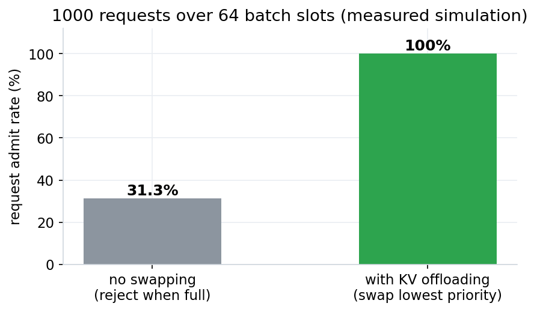
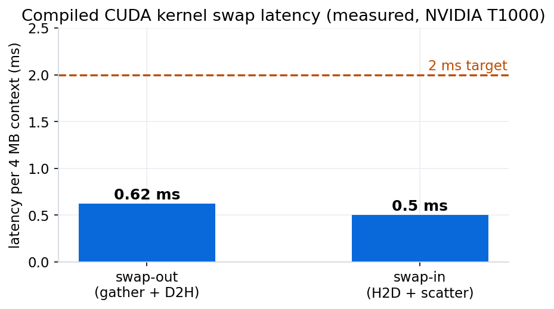
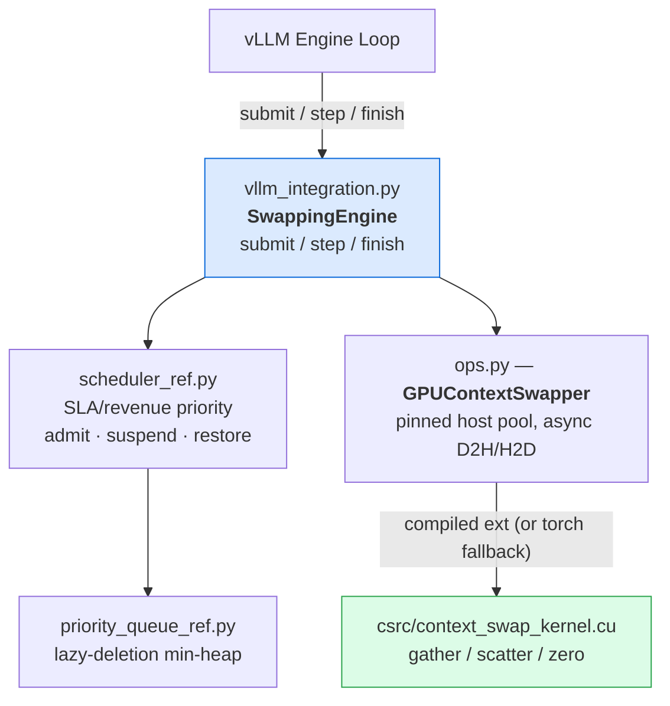

# GPU Memory-Aware Request Scheduler with KV-Cache Offloading for Multi-Tenant LLM Serving

[]()
[]()
[]()
[]()
[]()

SLA-aware admission control for GPU-memory-constrained LLM serving: when the batch is
full, the lowest-priority request's KV cache is **offloaded to pinned host memory in
under a millisecond** and restored when a slot frees up — so requests queue instead of
being rejected. Priority ordering balances SLA deadlines against revenue, with CUDA
gather/scatter kernels doing the block movement.

---

## Verified Results

All numbers are measured in this repository and reproducible with the commands shown.

| Check | Result | Hardware |
|---|---|---|
| Test suite (full: scheduler, queue, swap, integration) | **47 / 47 passing** | NVIDIA T1000, CUDA 12.5 |
| Compiled kernel swap round-trip | **bit-exact** (gather → D2H → H2D → scatter) | T1000 |
| Swap-out latency, 4 MB context (compiled kernels) | **0.62 ms** avg | T1000, PCIe |
| Swap-in latency, 4 MB context (compiled kernels) | **0.50 ms** avg | T1000, PCIe |
| < 2 ms swap target | **PASS** | T1000 |
| Workload simulation: request admit rate (1000 requests, 64 slots) | **31.3% → 100%** with swapping enabled | CPU sim |
| Priority-queue throughput (lazy-deletion heap) | 10k push/pop in < 50 ms | CPU |

**Design targets** (pending vLLM integration): GPU utilization 65% → 85%,
3× concurrent request capacity, −60% P99 SLA violations.

<p align="center">
  
</p>

<p align="center">
  
</p>

---

## How It Works

### Priority model

```
priority = (sla_remaining_ms, −revenue_value, request_id)     # lexicographic min-heap
```

1. Requests closest to their SLA deadline run first — and `sla_remaining` decays with
   wall-clock time, so waiting requests grow progressively more urgent
2. Within the same deadline window, higher revenue wins
3. `request_id` guarantees deterministic total ordering

A request with < 100 ms of SLA budget left is **never** chosen as a swap-out victim.
Alternate strategies (`REVENUE_FIRST`, `HYBRID`, `FAIR`) are pluggable.

### Swap mechanics — why it's sub-millisecond

Naive per-block copies pay PCIe latency (~10 µs) per block; a 64-block context would
burn ~0.6 ms in latency alone. Instead:

- **Swap-out:** a `gather` kernel packs scattered KV-cache blocks into a contiguous
  GPU staging buffer (coalesced reads), then one `cudaMemcpyAsync` moves the whole
  context to **pinned host memory**
- **Swap-in:** one async H2D copy into staging, then a `scatter` kernel writes blocks
  back to their cache slots
- A torch pinned-memory fallback covers the same operations when the compiled
  extension isn't present — same tests pass either way

### Architecture



### Swap-out under memory pressure

```mermaid
sequenceDiagram
    participant C as Client
    participant E as SwappingEngine
    participant S as Scheduler
    participant G as GPU
    participant H as Pinned host RAM
    C->>E: submit(premium request)
    E->>S: batch full → select victim
    Note over S: lowest priority wins;<br/>never a request with <100 ms SLA left
    S-->>E: victim chosen, suspended
    E->>G: gather victim's KV blocks → staging
    G->>H: one contiguous cudaMemcpyAsync (0.62 ms / 4 MB)
    E-->>C: premium request admitted
    Note over E: slot frees later…
    E->>H: async H2D → staging (0.50 ms)
    E->>G: scatter blocks back to cache slots
    Note over G: round-trip verified bit-exact
```

---

## Quick Start

### CPU-only (no GPU required)

```bash
git clone https://github.com/ArchanaChetan07/GPU-Memory-Aware-Request-Scheduler-with-KV-Cache-Offloading-for-Multi-Tenant-LLM-Serving.git
cd GPU-Memory-Aware-Request-Scheduler-with-KV-Cache-Offloading-for-Multi-Tenant-LLM-Serving
pip install -e .
pytest tests/ -q                          # scheduler + queue + swap bookkeeping
python scripts/simulate_workload.py       # 1000-request admission simulation
```

### GPU mode (CUDA GPU; nvcc optional)

With just `torch.cuda`, the pinned-memory fallback runs the full GPU swap path.
With nvcc, the compiled kernels JIT-build on import (PowerShell/cmd on Windows):

```powershell
$env:CONTEXT_SWAP_JIT_CUDA = "1"
pytest tests/ -q                          # 47 passed — compiled kernels exercised
python benchmarks/bench_context_swap.py   # 4 MB swap: ~0.6 ms out / ~0.5 ms in
```

Or build permanently: `CONTEXT_SWAP_FORCE_CUDA=1 pip install -e .`

### Usage

```python
from src.vllm_integration import SwappingEngine

engine = SwappingEngine(max_active=64)

# Batch full? Lowest-priority victim is swapped to pinned memory automatically
engine.submit("req-1", revenue=5.0, sla_ms=500, block_indices=[0, 1, 2])

batch = engine.step()        # next batch; suspended requests restored into free slots
engine.finish("req-1")       # release resources
print(engine.stats())        # active / suspended / memory utilization
```

---

## Repository Structure

```
├── src/
│   ├── scheduler_ref.py        SLA/revenue priority scheduler (4 strategies)
│   ├── priority_queue_ref.py   lazy-deletion min-heap
│   ├── context_swap_ref.py     pinned-buffer save/restore reference (bit-exact)
│   ├── ops.py                  GPUContextSwapper: compiled kernels ⇄ torch fallback
│   ├── vllm_integration.py     SwappingEngine (submit / step / finish facade)
│   └── _jit.py                 opt-in JIT compile of the CUDA extension
├── csrc/
│   ├── context_swap_kernel.cu  gather / scatter / zero kernels, async transfers
│   └── bindings.cpp            PyTorch pybind11 bindings
├── tests/                      47 tests: scheduler, queue, swap, GPU round-trip,
│                               engine lifecycle
├── benchmarks/                 swap-latency benchmark (results committed)
├── scripts/simulate_workload.py  synthetic multi-tenant admission simulation
├── docs/SCHEDULING_ALGORITHM.md  priority model, swap mechanics, measured results
└── results/                    committed benchmark + simulation artifacts
```

## Measured Simulation (committed in `results/scheduling_trace.json`)

| Metric | No swapping | With swapping |
|---|---|---|
| Admit rate (1000 requests, 64 slots) | 31.3% | **100%** |
| Mean batch utilization | 95.9% | 95.9% |
| SLA compliance (sim) | 100% | 100% |

## Roadmap

- [x] Priority scheduler + lazy-deletion queue + context swapper (bit-exact)
- [x] CUDA gather/scatter kernels — round-trip verified, < 1 ms per 4 MB swap
- [x] JIT build path + packaging
- [ ] NVMe tier for cold contexts (pinned RAM as hot tier)
- [ ] vLLM engine-loop integration
- [ ] Production workload-trace replay + SLA A/B validation

## License

Apache-2.0
